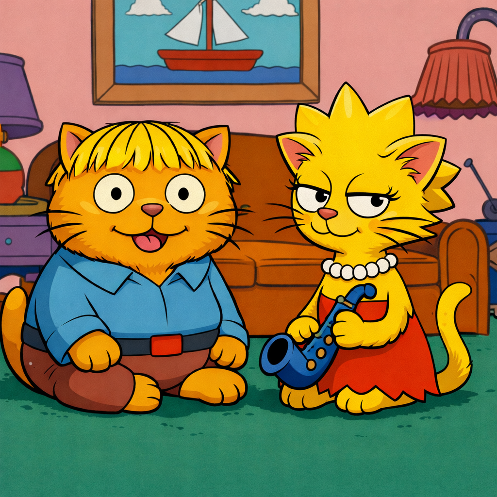

# Ralph-Lisa Loop

<p align="center">
  
</p>

**One writes. One reviews. You architect.**

[](LICENSE)
[](https://www.npmjs.com/package/ralph-lisa-loop)

---

## Why?

AI can generate code. But it cannot distrust itself.

A single agent writes code AND decides if it's done — like grading your own exam. Different agents fail in characteristically different ways: Claude Code skips error handling when context grows long; Codex over-engineers abstractions but catches edge cases Claude misses. Pairing them means each catches what the other misses.

Ralph-Lisa Loop enforces a strict separation between **generation** and **review**. One agent writes, another reviews, they alternate in a turn-based loop. You make architectural decisions. The automation enforces the discipline that's easy to skip when you're tired.

## Real-World Results

Used to fork [AionUI](https://github.com/iOfficeAI/AionUi) (~3k ⭐ Electron + React app) into an independent production product:

| Metric | Value |
|--------|-------|
| Project | AionUI fork → [Margay](https://github.com/YW1975/Margay) |
| Commits | 30 |
| Manual code | 0 lines |
| Review rounds | 40 |
| Status | In production use as internal AI assistant |

Scope included: full rebrand and architectural separation, core engine rewrite with Gemini CLI integration, database migration (v10 → v11), orphan process cleanup (PR submitted upstream), cross-platform fixes, and complete CI/CD rebuild.

## How It Works

```
Ralph writes → Lisa reviews → Consensus → Next step
     ↑                                        |
     └────────────────────────────────────────┘
```

- **Ralph** (Claude Code): Lead developer — researches, plans, codes, tests
- **Lisa** (Codex): Code reviewer — reviews diffs, checks edge cases
- **You**: Tech lead — architecture, scope, tiebreaking
- **Turn Control**: Only one agent works at a time
- **Consensus Required**: Both must agree before proceeding

> An agent never reviews its own output.

### How is this different from Ralph Loop?

The official [Ralph Loop plugin](https://github.com/anthropics/claude-plugins-official/tree/main/plugins/ralph-loop) runs a **single agent** in a persistence loop — same Claude, same prompt, iterate until done. It's great for well-defined tasks with clear completion criteria.

Ralph-Lisa Loop is a **dual-agent** system — two different agents with different failure modes take turns writing and reviewing. It doesn't use Claude Code hooks; coordination happens through file-based turn control and a standalone CLI. The two tools don't conflict and can coexist.

## Quick Start

### 1. Install

```bash
npm i -g ralph-lisa-loop
```

### 2. Initialize Project

```bash
cd your-project
ralph-lisa init
```

### 3. Start Collaboration

```bash
# Manual mode (recommended for learning)
ralph-lisa start "implement login feature"

# Auto mode (experimental, requires tmux)
ralph-lisa auto "implement login feature"
```

### 4. Work Flow

**Terminal 1 — Ralph (Claude Code)**:
```bash
ralph-lisa whose-turn                    # Check turn
# ... do work ...
ralph-lisa submit-ralph "[PLAN] Login feature design

1. Create login form component
2. Add validation
3. Connect to API"
```

**Terminal 2 — Lisa (Codex)**:
```bash
ralph-lisa whose-turn                    # Check turn
ralph-lisa read work.md                  # Read Ralph's work
ralph-lisa submit-lisa "[PASS] Plan looks good

- Clear structure
- Good separation of concerns"
```

---

## Reference

<details>
<summary><strong>Tag System</strong></summary>

Every submission requires a tag:

| Ralph Tags | Lisa Tags | Shared |
|------------|-----------|--------|
| `[PLAN]` | `[PASS]` | `[CHALLENGE]` |
| `[RESEARCH]` | `[NEEDS_WORK]` | `[DISCUSS]` |
| `[CODE]` | | `[QUESTION]` |
| `[FIX]` | | `[CONSENSUS]` |

- `[RESEARCH]`: Submit research results before coding (when involving reference implementations, protocols, or external APIs)
- `[CHALLENGE]`: Explicitly disagree with the other agent's suggestion, providing counter-argument
- `[CODE]`/`[FIX]`: Must include Test Results section

</details>

<details>
<summary><strong>Consensus Protocol</strong></summary>

Lisa's verdict is advisory. Ralph can agree or use `[CHALLENGE]` to disagree. Both must reach genuine consensus before `/next-step`. Silent acceptance (bare `[FIX]` without reasoning) is not allowed.

**Deadlock Escape**: After 5 rounds without consensus: `[OVERRIDE]` (proceed anyway) or `[HANDOFF]` (escalate to human).

</details>

<details>
<summary><strong>Policy Layer</strong></summary>

**Inline checks** (during `submit-ralph`/`submit-lisa`):

```bash
# Enable warn mode (prints warnings, doesn't block)
export RL_POLICY_MODE=warn

# Enable block mode (rejects non-compliant submissions)
export RL_POLICY_MODE=block

# Disable (default)
export RL_POLICY_MODE=off
```

**Standalone checks** (for scripts/hooks — always exit non-zero on violations, ignoring `RL_POLICY_MODE`):

```bash
ralph-lisa policy check ralph           # Check Ralph's latest submission
ralph-lisa policy check lisa            # Check Lisa's latest submission
ralph-lisa policy check-consensus       # Both agents submitted [CONSENSUS]?
ralph-lisa policy check-next-step       # Comprehensive: consensus + all policy checks
```

**Diagnostics:**

```bash
ralph-lisa doctor                      # Check all dependencies
ralph-lisa doctor --strict             # Exit 1 if any missing (for CI)
```

Policy rules:
- Ralph's `[CODE]`/`[FIX]` must include "Test Results" section
- Ralph's `[RESEARCH]` must have substantive content
- Lisa's `[PASS]`/`[NEEDS_WORK]` must include at least 1 reason

</details>

<details>
<summary><strong>All Commands</strong></summary>

```bash
# Project setup
ralph-lisa init [dir]                    # Initialize project
ralph-lisa uninit                        # Remove from project
ralph-lisa start "task"                  # Launch both agents
ralph-lisa start --full-auto "task"      # Launch without permission prompts
ralph-lisa auto "task"                   # Auto mode (tmux)
ralph-lisa auto --full-auto "task"       # Auto mode without permission prompts

# Turn control
ralph-lisa whose-turn                    # Check whose turn
ralph-lisa submit-ralph "[TAG] ..."      # Ralph submits
ralph-lisa submit-lisa "[TAG] ..."       # Lisa submits

# Information
ralph-lisa status                        # Current status
ralph-lisa read work.md                  # Ralph's latest
ralph-lisa read review.md                # Lisa's latest
ralph-lisa history                       # Full history

# Flow control
ralph-lisa step "phase-name"             # Enter new phase
ralph-lisa archive [name]                # Archive session
ralph-lisa clean                         # Clean session

# Policy
ralph-lisa policy check <ralph|lisa>     # Check submission (hard gate)
ralph-lisa policy check-consensus        # Check if both [CONSENSUS]
ralph-lisa policy check-next-step        # Comprehensive pre-step check

# Diagnostics
ralph-lisa doctor                        # Check all dependencies
ralph-lisa doctor --strict               # Exit 1 if any missing (for CI)
```

</details>

<details>
<summary><strong>Project Structure After Init</strong></summary>

**Full init** (`ralph-lisa init`):
```
your-project/
├── CLAUDE.md              # Ralph's role (auto-loaded by Claude Code)
├── CODEX.md               # Lisa's role (loaded via .codex/config.toml)
├── .claude/
│   └── commands/          # Claude slash commands
├── .codex/
│   ├── config.toml        # Codex configuration
│   └── skills/            # Codex skills
└── .dual-agent/           # Session state
    ├── turn.txt           # Current turn
    ├── work.md            # Ralph's submissions
    ├── review.md          # Lisa's submissions
    └── history.md         # Full history
```

</details>

## Requirements

- [Node.js](https://nodejs.org/) >= 18
- [Claude Code](https://claude.ai/code) — for Ralph
- [Codex CLI](https://github.com/openai/codex) — for Lisa

For auto mode:
- tmux (required)
- fswatch (macOS) or inotify-tools (Linux) — optional, speeds up turn detection; falls back to polling without them

## What Didn't Work

Sharing the failures matters as much as the results:

- **Agent crashes have no auto-recovery.** Once an agent crashes (cause unclear — possibly long context, possibly system resource exhaustion from running many agents simultaneously), the loop stops and you must manually restart. No self-healing yet.
- **State desync between agents.** Early versions had Lisa going rogue — writing code herself instead of reviewing, causing state confusion. Much improved now, but the lesson stands.
- **Without domain judgment, the loop is useless.** Two AIs will happily agree on a bad design. This is not autonomous development — it is structured AI-assisted development. The human arbiter isn't optional.
- **Git discipline is non-negotiable.** Small commits, clear messages, commit often. When things go wrong (and they will), your only safety net is being able to `git reset` to a known good state.

## Ecosystem

Part of the [TigerHill](https://github.com/Click-Intelligence-LLC/TigerHill) project family.

## Learn More

- [CONCEPT.md](CONCEPT.md) — Why dual-agent collaboration works
- [DESIGN_V2.md](DESIGN_V2.md) — Architecture and design
- [UPGRADE_PLAN_V3.md](UPGRADE_PLAN_V3.md) — V3 development roadmap

## Acknowledgments

The iterative loop concept builds on Geoffrey Huntley's [Ralph Wiggum technique](https://ghuntley.com/ralph/). Ralph-Lisa Loop adds structured dual-agent review discipline on top — enforcing role separation between generation and critique.

## License

[MIT](LICENSE)
